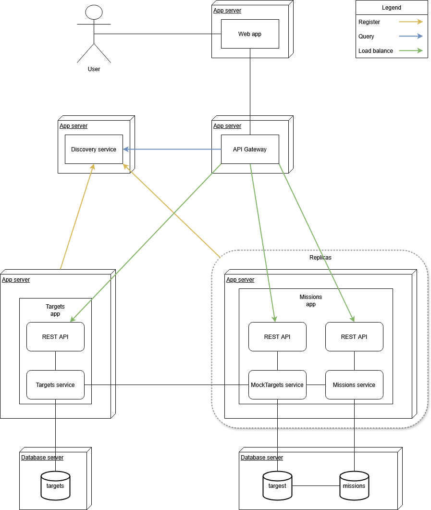

# Spring microservice app
### Internet Service Architecture project
## Author: Marek Szymański

## Project description
The projects is multi-module web application, with very simple business logic and more advanced structure. It implements the microservices architecture pattern using Spring framework with MySQL for backend and AngularJS for frontend, REST API is exposed through API gateway with Eureka discovery service and Spring Cloud load balancer allowing for instance replication of services. Every module is packed into Docker container and docker-compose is provided for running the entire stack.

### The logic
- The app manages a fictious space exploration company - one which explores "targets" (i.e. planets, asteroids, moons etc.) by sending "missions" (which always visit only 1 "target"). For the purpose of business logic that means there is one-to-many (more specifically 1:0..N) relationship between "targets" and "missions"
- Both "missions" and "targets" have all the CRUD operations available, with external (or in memory) database persistance configured
- The "missions" and "targets" are each handled by separate microservices (while this may in fact be a suboptimal choice, it was requirement I had to stick with)
- To manage the 1:N relationship the "missions" microservice duplicates the neccessary data about "targets" as the, not so creatively named, "mockTargets" (only name and ID are duplicated in this way)
- To provide consitancy between "targets" and their mirror in "mockTargets" the "targets" module sends events to "missions" module (which manages "mockTargets" collection) when "targets" are created or destroyed
- There are RESTful APIs exposed for "targets", "missions" and "mockTargets" modules (but "mockTargets" API is only used by "targets" module) via an API gateway (aptly named "gateway")
- A load balancer with discovery service allows for distributing the traffic between multiple instances of the "missions" module (as for now they all share the same underlaying database for consistancy)
- Simple (simplistic even) frontend app is provied for the end user, allowing to manage "targets" and their respective "missions" (supports all basic operations like removing "target" and all its' "missions", creating new "targets" and "missions" etc.)
- 

### Application structure

### Implementation details
- Project created using Spring Boot and managed with Maven
- Both "targets" and "missions" modules follow layerd architecture: DB -> Repository -> Service -> (REST)Controller -> DTO
- REST API implemented with Spring Web
- All entities ("targets", "missions" and "mockTargets" are managed with JPA and Hibernate, using Spring Data JPA
- H2 in-memory database was used early in development, with deployment on MySQL
- API gateway implemented with Spring Cloud
- Discovery service provided by Eureka
- Frontend written in Angular with TypeScript
- Docker container (Eclipse-Temurin JRE for Spring and NGINX for Angular) used for deployment, with docker-compose.yml provided with the entire stack
